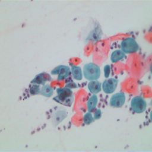

# MediAug

## Overview

MediAug is a set of tools for data augmentation of histology
slides. It is primaraly developed for cervical cancer by
augmenting Pap smear slides. However, it can be extended to
any cell data that has an image and mask of different types of
cells. Currently supports general image augmentation techniques
as well as specialized ones like cell insertion and blending.



## Installation

To install:

```bash
$ git clone https://github.com/smwade/MediAug
$ python setup.py install
```

## Datasets

There are two main open datasets for Pap smear images and MediAug is able to support both.

###  SMEAR

The SMEAR dataset is 917 indavidual cells. They are segmented by nucleus and cytoplasm.

<https://mde-lab.aegean.gr/downloads>

### SPIaKMeD

The SIPaKMeD Database consists of 4049 images of isolated cells that have been manually cropped from 966 cluster cell images of Pap smear slides. These images were acquired through a CCD camera adapted to an optical microscope. The cell images are divided into five categories containing normal, abnormal and benign cells.

<http://cs.uoi.gr/~marina/sipakmed.html>


## Custom Dataset

The data pipeline can work with other datasets besides SIPaKMed and SMEAR. In order to
use another, you must convert the data to the correct format.

```
slides/
  metaplastic/
    image/
    mask/
  parabasal/
    image/
    mask/
  ...
```

And for cells:

```
cells/
  metaplastic/
    image/
    mask/
  parabasal/
    image/
    mask/
  ...
```

## Notebooks

To show the library in action there are several notebooks that address key aspects of the library, such as what is a dataset, using Operations, and creating a Pipeline. These are found in `notebooks/`

## CLI

MediAug comes with a CLI with useful scripts. These include:

* generate-augment-dataset
* prepare-pix2pix-images
* resize-images

The list of all can be seen with the command

```bash
$ mediaug --help
```

### Generate cell augmented dataset

```bash
$ mediaug generate-augment-dataset --slide_dir <slide_dir> --cell_dir <cell_dir> --out_dir <out_dir> --num 1000 --max_cells <10>
```

### Prepare images for Pix2Pix

```bash
$ mediaug prepare-pix2pix-images --image_dir <image_dir> --mask_dir <mask_dir> --out_dir <out_dir> --split_ratio <split_ratio>
```

### Recursivly resize all images in directory

```bash
$ mediaug resize-images --input_dir <input_dir> --out_dir <out_dir> --w 256 --height 256
```
